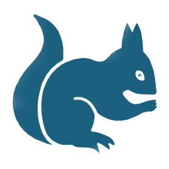
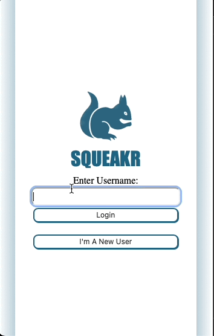
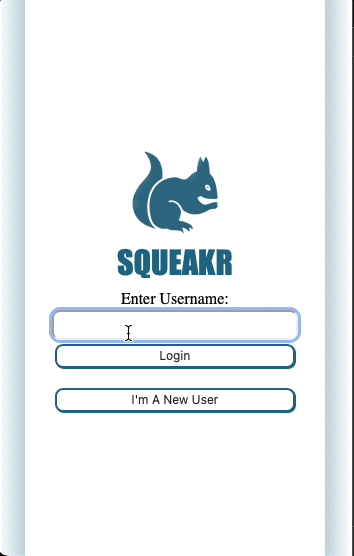

## Squeakr - Turing Capstone Project

     

#### Contributors: [Gavin Carew](https://github.com/gjcarew) | [Jedeo Manirikumwenatwe](https://github.com/Jedeo) | [Noah van Ekdom](https://github.com/noahvanekdom) | [Colby Pearce](https://github.com/Crpearce) | [Anna Marie Sterling](https://github.com/AMSterling) | [Catalyst](https://github.com/Catalyst4Change) | [Ken Lenhart](https://github.com/Penitent0)

---

## Description

A React-based twitter clone built around robust moderation tools. Uses a service-oriented architecture with a Rails backend accessed via GraphQL

[Check out the the back-end repo](https://github.com/Squeaker-2207/squeaker-fe)

---

#  Table of contents

- [Setup](#setup)
- [Deployed Link](#deployment)
- [Project Specs](#specs)
- [Challenges](#challenges)
- [Wins](#wins)
- [Endpoints](#endpoints)
- [Future Extensions](#future)

# Getting Started with Create React App

This project was bootstrapped with [Create React App](https://github.com/facebook/create-react-app).

Add setup instructions at a later time

# Deployed UI

Please take a look at the link to our deployed UI: https://squeaker-fe.vercel.app

# Project Specs

The project specs and rubric for Squeakr can be found [here](https://mod4.turing.edu/projects/capstone/)

# Challenges

-
-

# Wins

-
-
-

# Future Extensions

- 
  
